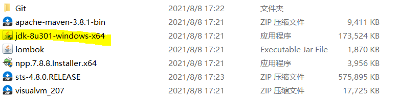

# 环境搭建日志

### 1.安装JDK

双击jdk-8u301-windows-x64.exe文件执行安装

新建系统环境变量（如果无法访问系统环境变量，则新建用户环境变量，下同）：

JAVA_HOME
c:\Program Files\Java\jdk1.8.0_301

新建系统环境变量：
classpath
.;%JAVA_HOME%\lib

在已有系统环境变量Path增加以下内容：
%JAVA_HOME%\bin

验证安装配置结果
运行CMD，执行下命令
java -version

### 2.Eclipse安装

在eclipse官网中下载eclipse安装包

找到下载的安装包并解压

打开解压后的安装包，双击eclipse.exe

点击下一步，设置工作区，完成安装

### 3.Git注册与联动

Git注册

完成注册

进入‘https://classroom.github.com/'

输入Github账户密码

与名册上个人名称关联

接受作业